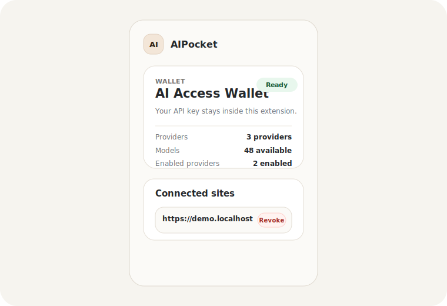
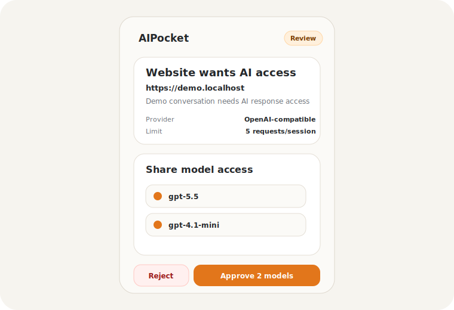
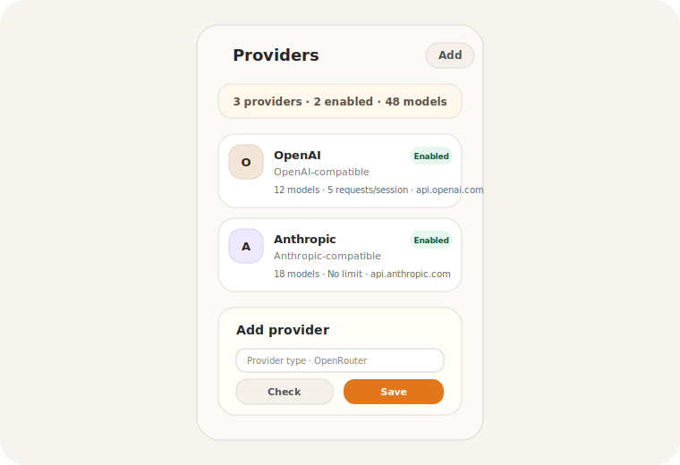
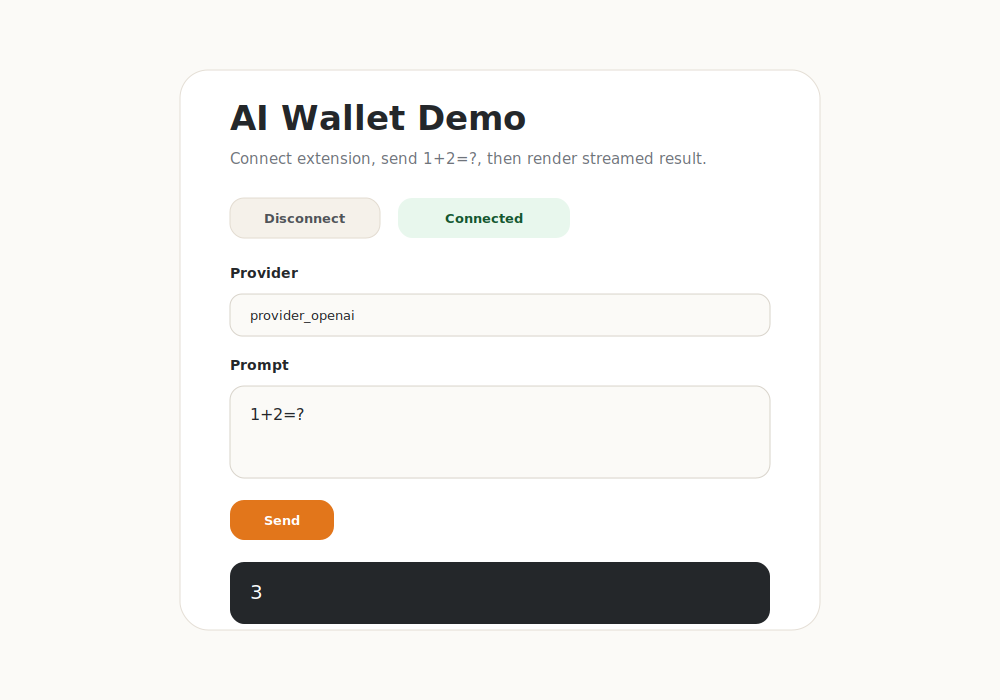

# AI Wallet

AI Wallet is a Chrome MV3 extension that lets websites request user-approved AI model access without receiving the user's API keys.

It works like a wallet for AI API access: the extension stores provider credentials, websites request scoped permission, and approved sessions can stream model output through the extension.

## Screenshots

| Wallet | Connection approval |
| --- | --- |
|  |  |

| Provider management | Demo app |
| --- | --- |
|  |  |

## Why

Many AI-powered websites ask users to paste provider API keys directly into the web app. That gives the website long-lived credentials it does not need.

AI Wallet moves API keys into a browser extension. Websites receive only scoped, revocable access to approved providers and models.

## Features

- Store provider API keys inside the extension.
- Add OpenAI-compatible, Anthropic-compatible, OpenRouter, and Gemini providers.
- Approve website access per origin, provider, model list, and session.
- Enforce optional per-session request limits.
- Stream model output back to websites without exposing provider keys.
- Use `@ai-wallet/connect-modal` to integrate with web apps.

## Quick Start

```sh
npm install
npm run build
```

Load `apps/extension/dist` in Chrome:

1. Open `chrome://extensions`.
2. Enable `Developer mode`.
3. Click `Load unpacked`.
4. Select `apps/extension/dist`.

## Configure A Provider

1. Open the extension popup.
2. Go to `Providers`.
3. Click `Add`.
4. Choose `OpenAI-compatible`, `Anthropic-compatible`, `OpenRouter`, or `Gemini`.
5. Enter provider name and API key.
6. Enter endpoint when the provider type shows an endpoint field.
7. Optionally set `Max requests per session`.
8. Click `Check connection`.
9. Click `Save provider`.

## Developer Integration

```ts
import { connectAiWallet, requestResponseStream } from "@ai-wallet/connect-modal";

const permission = await connectAiWallet({
  providerId: "provider_openai",
  models: ["gpt-5.5"],
  reason: "This app needs AI access for chat responses"
});

await requestResponseStream({
  sessionId: permission.sessionId,
  providerId: permission.providerId,
  model: permission.models[0],
  input: "1+2=?",
  onDelta(delta) {
    console.log(delta);
  }
});
```

See `docs/integration.md` for full integration details.

## Local Demo

```sh
npm run dev -w @ai-wallet/demo-web
```

Open the local URL in the same Chrome profile where AI Wallet is installed. Connect the demo, approve access in the extension, keep the prompt `1+2=?`, and send. Expected output: `3`.

Demo video: [`docs/assets/videos/demo.mov`](docs/assets/videos/demo.mov)

See `docs/local-demo.md` for a full walkthrough.

## Monorepo

- `apps/extension`: Chrome MV3 extension.
- `apps/demo-web`: React demo website.
- `packages/connect-modal`: website-facing integration helper.
- `packages/protocol`: shared protocol types and validation helpers.
- `docs`: architecture, setup, and integration guides.

## Commands

```sh
npm run test
npm run typecheck
npm run build
```

## Security Model

Websites never receive API keys. The extension validates origin, session, provider, approved model, expiration, and request limit before brokering any upstream request.

Current MVP protections:

- Provider API keys stay in extension storage.
- Websites only receive session metadata and streamed output.
- Sessions are scoped to origin, tab, frame, provider, approved models, and expiration.
- Stream requests are rejected when provider/model/session checks fail.
- Optional request limits are enforced per approved session.

## Status

AI Wallet is an MVP/prototype moving toward public release. It is not yet published to the Chrome Web Store.

## Roadmap

- Improve provider discovery and provider selection UX for websites.
- Add usage visibility and stronger quota controls.
- Harden MV3 stream lifecycle behavior.
- Prepare Chrome Web Store listing assets and review checklist.
- Publish integration packages when protocol stabilizes.

## License

Apache-2.0. See `LICENSE`.
