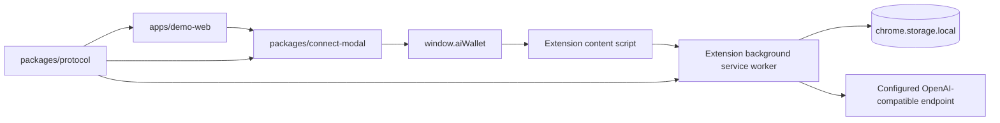
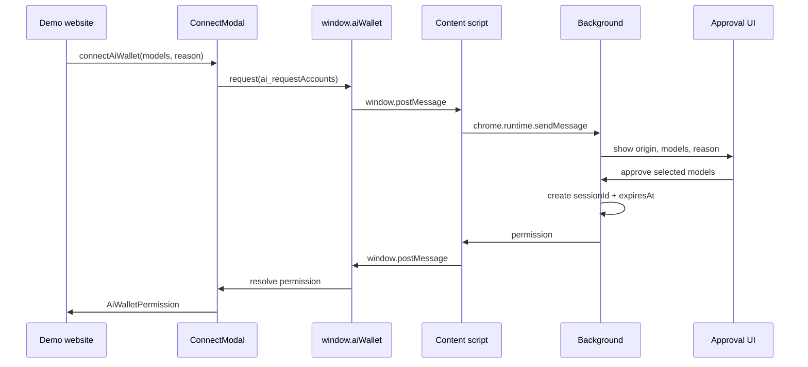
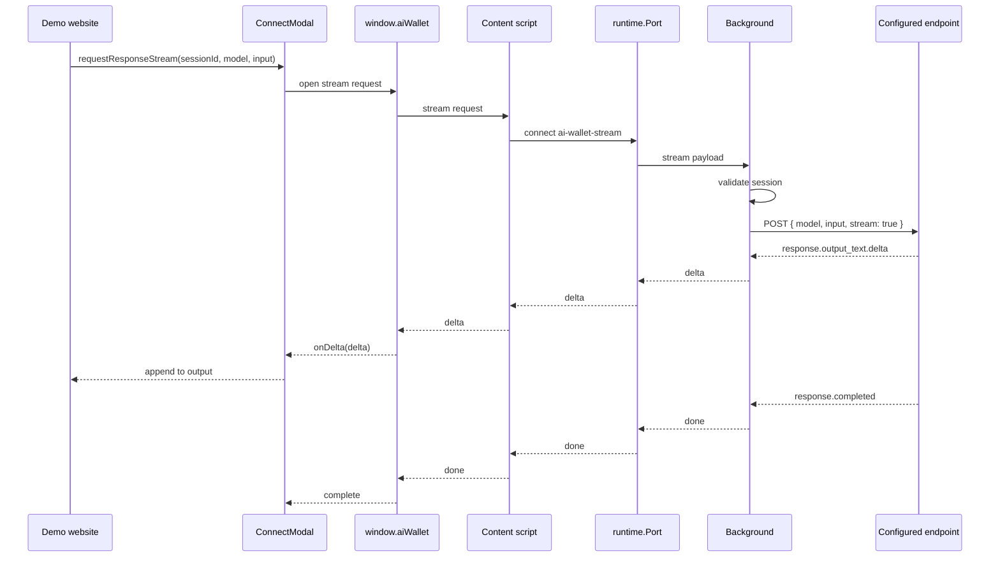
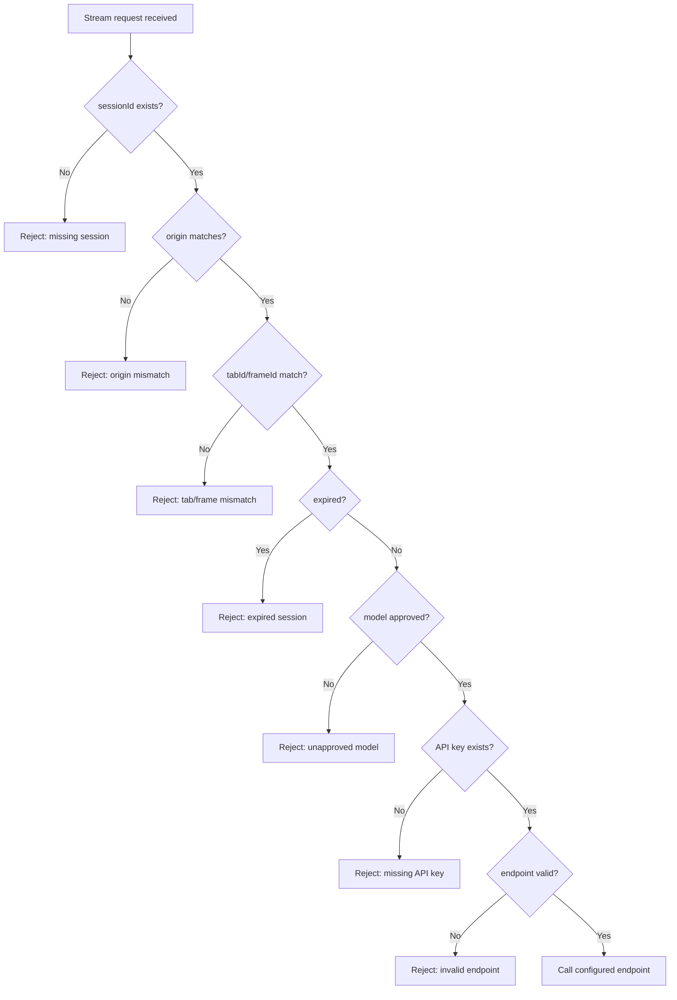
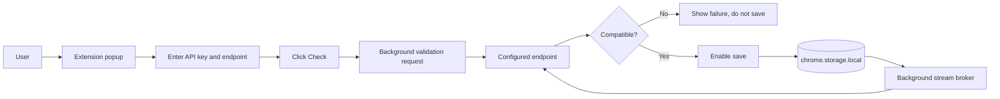
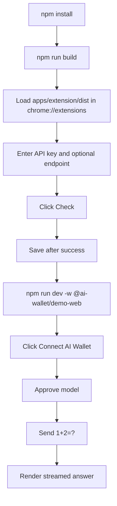

# MVP Flow Diagrams

## Module Architecture

```mermaid
flowchart LR
  Demo[apps/demo-web] --> Modal[packages/connect-modal]
  Modal --> Provider[window.aiWallet]
  Provider --> Content[Extension content script]
  Content --> Background[Extension background service worker]
  Background --> Storage[(chrome.storage.local)]
  Background --> Endpoint[Configured OpenAI-compatible endpoint]
  Protocol[packages/protocol] --> Modal
  Protocol --> Background
  Protocol --> Demo
```

## Connect And Approval Flow

```mermaid
sequenceDiagram
  participant Site as Demo website
  participant SDK as ConnectModal
  participant Provider as window.aiWallet
  participant Content as Content script
  participant BG as Background
  participant UI as Approval UI

  Site->>SDK: connectAiWallet(models, reason)
  SDK->>Provider: request(ai_requestAccounts)
  Provider->>Content: window.postMessage
  Content->>BG: chrome.runtime.sendMessage
  BG->>UI: show origin, models, reason
  UI->>BG: approve selected models
  BG->>BG: create sessionId + expiresAt
  BG->>Content: permission
  Content->>Provider: window.postMessage
  Provider->>SDK: resolve permission
  SDK->>Site: AiWalletPermission
```

## Streaming Flow

```mermaid
sequenceDiagram
  participant Site as Demo website
  participant SDK as ConnectModal
  participant Provider as window.aiWallet
  participant Content as Content script
  participant Port as runtime.Port
  participant BG as Background
  participant AI as Configured endpoint

  Site->>SDK: requestResponseStream(sessionId, model, input)
  SDK->>Provider: open stream request
  Provider->>Content: stream request
  Content->>Port: connect ai-wallet-stream
  Port->>BG: stream payload
  BG->>BG: validate session
  BG->>AI: POST { model, input, stream: true }
  AI-->>BG: response.output_text.delta
  BG-->>Port: delta
  Port-->>Content: delta
  Content-->>Provider: delta
  Provider-->>SDK: onDelta(delta)
  SDK-->>Site: append to output
  AI-->>BG: response.completed
  BG-->>Port: done
  Port-->>Content: done
  Content-->>Provider: done
  Provider-->>SDK: complete
```

## Session Validation Flow

```mermaid
flowchart TD
  Start[Stream request received] --> HasSession{sessionId exists?}
  HasSession -- No --> RejectMissing[Reject: missing session]
  HasSession -- Yes --> Origin{origin matches?}
  Origin -- No --> RejectOrigin[Reject: origin mismatch]
  Origin -- Yes --> Tab{tabId/frameId match?}
  Tab -- No --> RejectTab[Reject: tab/frame mismatch]
  Tab -- Yes --> Expired{expired?}
  Expired -- Yes --> RejectExpired[Reject: expired session]
  Expired -- No --> Model{model approved?}
  Model -- No --> RejectModel[Reject: unapproved model]
  Model -- Yes --> Key{API key exists?}
  Key -- No --> RejectKey[Reject: missing API key]
  Key -- Yes --> Endpoint{endpoint valid?}
  Endpoint -- No --> RejectEndpoint[Reject: invalid endpoint]
  Endpoint -- Yes --> Call[Call configured endpoint]
```

## Settings Flow

```mermaid
flowchart LR
  User[User] --> Popup[Extension popup]
  Popup --> Input[Enter API key and endpoint]
  Input --> Check[Click Check]
  Check --> Validate[Background validation request]
  Validate --> AI[Configured endpoint]
  AI --> Result{Compatible?}
  Result -- No --> Error[Show failure, do not save]
  Result -- Yes --> Save[Enable save]
  Save --> Storage[(chrome.storage.local)]
  Storage --> BG[Background stream broker]
  BG --> AI
```

## Install And Run Flow

```mermaid
flowchart TD
  InstallDeps[npm install] --> Build[npm run build]
  Build --> Load[Load apps/extension/dist in chrome://extensions]
  Load --> Configure[Enter API key and optional endpoint]
  Configure --> Check[Click Check]
  Check --> Save[Save after success]
  Save --> RunDemo[npm run dev -w @ai-wallet/demo-web]
  RunDemo --> Connect[Click Connect AI Wallet]
  Connect --> Approve[Approve model]
  Approve --> Send[Send 1+2=?]
  Send --> Stream[Render streamed answer]
```
